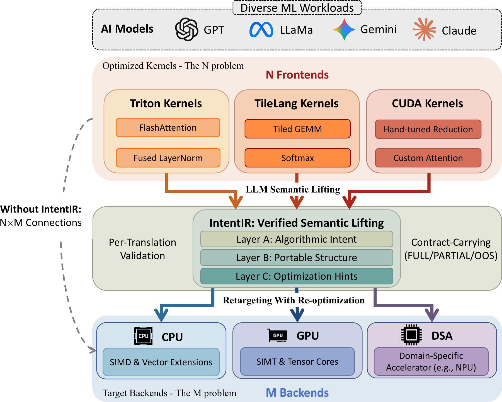

# IntentIR

IntentIR is a TianChen Stack subproject for turning optimized ML kernels into
auditable, portable operator assets.

Modern ML systems increasingly rely on hardware-specialized kernels written in
Triton, TileLang, CUDA, and library-specific operator stacks. These kernels are
fast because they mix two things together: the tensor computation being
performed, and the schedule choices used to map that computation onto a
particular machine. That coupling makes kernels difficult to inspect, validate,
reuse, and retarget.

IntentIR attacks that problem with certified semantic lifting. It lifts
frontend-specific kernels into a unified intent-level IR, validates the recovered
artifact against frontend evidence and source execution, then lets downstream
backends consume one contract-bearing representation instead of building a
separate translator for every frontend/backend pair.



The figure above shows the central interface:
without a common IR, `N` kernel frontends and `M` target backends create an
`N x M` translation problem. IntentIR reduces that to `N` frontend lifters plus
`M` backend consumers over one shared semantic artifact.

## Role in TianChen Stack

Within TianChen Stack, IntentIR is the frontend and operator-asset IR layer.
Its job is not to be another isolated benchmark harness or a paper-only
prototype. It is the part of the stack that makes heterogeneous operator assets
usable as compiler inputs:

- It accepts optimized kernels and provider assets from Triton, TileLang, CUDA,
  and Triton-backed operator libraries such as FlagGems.
- It normalizes them into a unified IntentIR representation that records what
  the operator computes, what correctness constraints must hold, and which
  schedule facts are only hints.
- It gives backend compiler work a stable contract: CUDA, RVV, and future
  TianChen targets should consume the same recovered intent rather than
  re-implementing frontend-specific semantics.
- It keeps source optimization knowledge available as non-binding guidance, so
  a backend can retune for its own hardware instead of freezing the source
  schedule as semantics.

In short: IntentIR is the semantic bridge between frontend/operator assets and
the rest of the TianChen compilation stack.

## Core Idea

Conceptually, IntentIR is the inverse of ordinary lowering. Instead of starting
with a clean tensor program and lowering it to a specialized kernel, IntentIR
starts from a schedule-specialized implementation and recovers a portable,
executable, checkable intent artifact.

The recovered representation has three layers:

- **Layer A: algorithmic intent.** Tensor-level computation, operator
  structure, data types, symbolic shapes, axis roles, and semantic layout
  choices.
- **Layer B: portable execution structure.** Correctness-relevant facts such as
  index expressions, masks, bounds, shape/layout constraints, dependencies,
  synchronization, and controlled atomics.
- **Layer C: non-binding schedule hints.** Tile sizes, thread mappings, vector
  widths, pipeline depths, and other source optimization choices that may guide
  retuning but do not define semantics.

This separation is the main design point. Layer A and Layer B are binding and
validated. Layer C is useful, but retunable.

## Validation Boundary

IntentIR does not trust an LLM or a heuristic extractor as the source of truth.
The lifter uses frontend evidence and may use an LLM as a constrained proposer,
but an artifact is accepted only after validation:

- schema and type checks over the IntentIR artifact;
- frontend evidence extraction into canonical anchors, accesses, predicates,
  shapes, layouts, and synchronization/atomic summaries;
- obligation checks for anchor coverage, structured access, guarded bounds,
  interface consistency, address independence, synchronization, and atomics;
- source-execution agreement against the original kernel path when a runnable
  source is available;
- certificate records that preserve checked obligations, witnesses,
  assumptions, and FULL/PARTIAL/OOS contract status.

This is why the repository is organized as a compiler pipeline rather than as a
collection of generated artifacts.

## Repository Layout

- `intent_ir/`: core IR data model, parser, validation helpers, macro
  expansion, canonicalization, and MLIR bridge.
- `frontends/`: frontend adapters and evidence extraction for Triton, TileLang,
  and CUDA.
- `pipeline/`: orchestration code that connects frontend lifting, validation,
  provider integration, MLIR contract emission, and backend handoff.
- `backends/`: CUDA and RVV backend contract/runtime paths.
- `kernels/`: compact source kernels used as frontend assets and smoke cases.
- `verify/`: interpreter, diff runner, metamorphic checks, mutation utilities,
  tolerances, and case generation.
- `compiler/intentir_mlir_plugin/`: optional C++ MLIR plugin source.
- `scripts/`: curated runnable entrypoints for environment checks, frontend
  verification, MLIR tooling, backend smoke checks, and provider matrix runs.
- `tests/`: curated fast tests for the semantic core, MLIR/backend lowering,
  provider boundaries, and pipeline behavior.
- `docs/assets/`: the design figure asset referenced by this README.

This cleaned repository intentionally does not include historical archives,
manuscript source, workflow state, generated experiment outputs, local
toolchains, Triton dumps, or Python bytecode caches.

## Quickstart

Create an environment:

```bash
python -m venv .venv
source .venv/bin/activate
pip install -r requirements/dev.txt
```

Run the fast reproducibility gate:

```bash
pytest -q
```

Check local optional dependencies and accelerator visibility:

```bash
python scripts/intentir.py env
```

Run a pure IntentIR/MLIR sanity check:

```bash
python scripts/intentir.py mlir check
```

Optional GPU/frontend workflows require CUDA-compatible PyTorch plus the GPU
extras:

```bash
pip install -r requirements/gpu.txt
python scripts/intentir.py suite --suite triton-native-coverage --kernel add2d --cases-limit 1
```

Long FlagGems matrix and remote RVV runs write fresh evidence under
`artifacts/`. They are intentionally generated by scripts rather than committed
to the repository.

## Reproducibility Boundary

The repository is reproducible at two levels:

- **Fast local gate:** `pytest -q` covers the IntentIR schema/parser,
  interpreter behavior, MLIR conversion and lowering contracts, provider
  boundaries, and selected pipeline utilities. This gate is meant to run without
  copying any historical artifact tree.
- **System-level evidence:** full frontend/provider/backend runs regenerate
  their own artifacts under `artifacts/`. CUDA, Triton, TileLang, FlagGems, and
  RVV availability depend on the host environment, so those paths are optional
  and parameterized through scripts.

The important rule is that checked-in source is the source of truth. Outputs,
workflow snapshots, manuscript tables, compiled kernels, and caches are not
required to understand or rebuild the project.

## Development Notes

Use the existing frontend/backend split when extending the system:

- add frontend-specific extraction under `frontends/<name>/`;
- keep reusable orchestration in `pipeline/`;
- add target-specific lowering/runtime code under `backends/<target>/`;
- add semantic operators in `intent_ir/ops/` and interpreter coverage in
  `verify/`;
- keep generated evidence under `artifacts/`, not in source directories.

IntentIR should remain the shared semantic interface for TianChen Stack
operator assets: frontend-specific enough to preserve evidence, but
backend-neutral enough to retarget.
